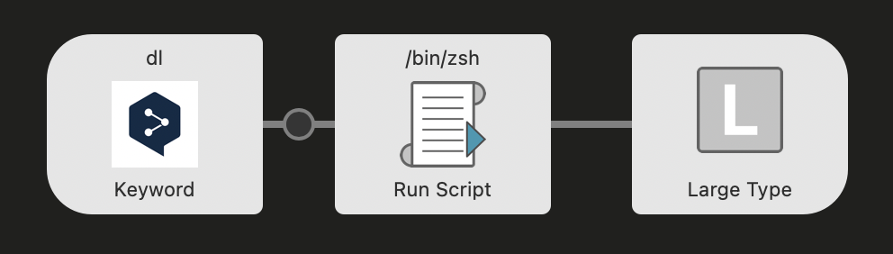

# Alfred-Scripts

## Overview
This repository contains various scripts for the Mac launcher application “Alfred”.
A paid version of Alfred is required for use.
A summary of each script is below.

- deepl_translator.rb
  - Converts input English to Japanese and Japanese to English and outputs the result.

## deepl_translator.rb
Converts input English to Japanese and Japanese to English and outputs the result.

To use this, I recommend using Ruby version 3.x.x or higher, as the version of Ruby included by default on Macs is out of date. The script should be called from zsh, and Ruby is executed from zsh.

Also, install `rest-client` using gem.
```
gem install rest-client --user-install
```

The script input setting should be “with input as {query}”.

The workflow is shown in the figure below.



It is easy to use, just type in the sentence you want to translate, leaving a space after the keyword you have set.
```
<keyword> <sentence you want to translate>
```
example↓
```
dl Alfred is amazing.
```